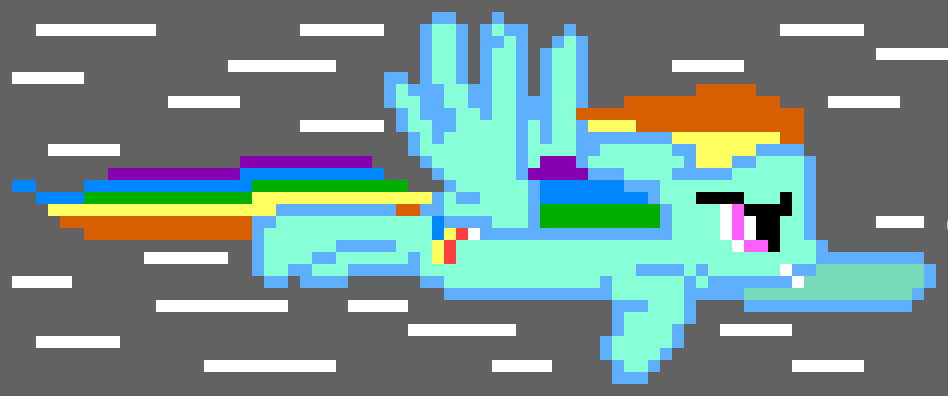
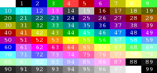
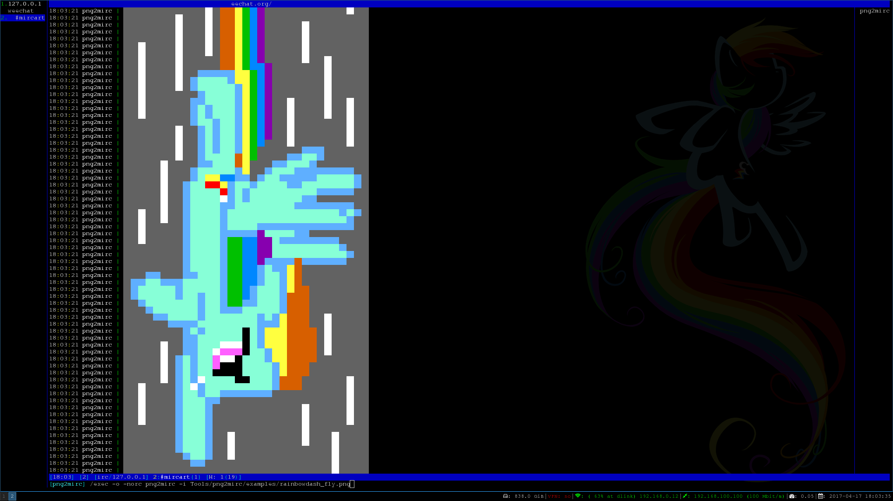
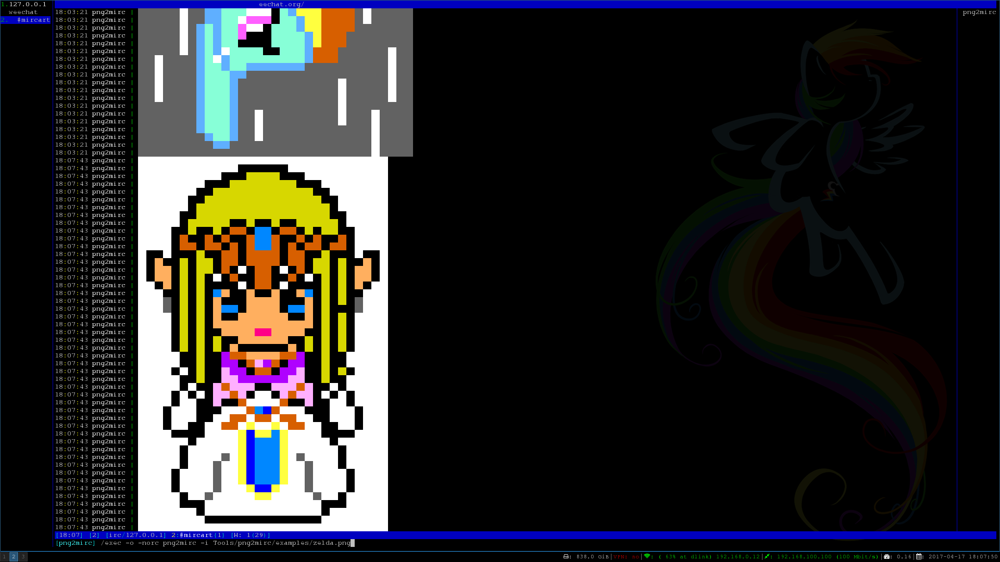

# png2mirc #
[](http://www.gnu.org/licenses/gpl-3.0)  

`png2mirc` allows you to share your pixel art creations with your IRC friends.

`png2mirc` has been tested with Weechat.

Just Check out this Rainbow Dash PixelArt you can send your to your friends on IRC:


## Dependencies ##
- [`Python 3`](https://www.python.org)
- [`Pillow`](https://python-pillow.org/)
- [`Gimp or other Image Editor`](https://www.gimp.org/)

### Installation ###
```
sudo apt-get -y install python3 pip
sudo pip3 install Pillow
git clone --recursive https://www.github.com/lillypad/png2mirc.git
cd png2mirc
sudo cp png2mirc.py /usr/bin/png2mirc
```

#### Creating Art ####
- Open Gimp
- From Gimp open palette.xcf
- Create a new file the size you like recommended is 40x40
- Right click "Background" layer and click "Add Alpha Channel"
- Zoom in all the way then under `View Menu` click `Show Grid` then click `Configure Grid` under the `Image menu` to 1px by 1px
- Use colorpicker to select from the palette the colors you like to create your new image
- All colors not in the colorpalette if put in by mistake will show up as white by default

### Sharing Art on IRC ###
- Open weechat
- Join IRC Channel
- Run `/exec -o -norc png2mirc -i examples/rainbowdash_fly.png`

If you wish to test your art in IRC before you share it on a public channel with your friends a submodule for hircd is included to run hircd do:
```
cd hircd/
python2.7 hircd.py --start --foreground --verbose -a 127.0.0.1 -p 6677
```

Now you should be able to connect in `Weechat` by doing:
```
/connect 127.0.0.1/6677
/join #test
/exec -o -norc png2mirc -i examples/rainbowdash_fly.png
```

`hircd` is not designed to be secure as it is is just for testing please keep this in mind.

### Files Included ###
- `scripts/mirc.sh` - Shows MIRC Color Palette in IRC
- `xterm.sh` - Shows `xterm-256color` standard palette in terminal
- `examples/*.xcf` - `Gimp` project file examples
- `examples/*.png` - Example Images
- `examples/*.mirc` - `MIRC` escaped images
- `examples/*.ansi` - `xterm-256color` equivelent ansi art
- `palette/palette.lst` - Contains `MIRC` color codes and their associated `RGBA` values
- `palette/palette.xcf` - `Gimp` project file to use as a color swatch for your creations

<b>MIRC Palette:</b><br>


You should be happy I made this as `MIRC` doesn't even provide a full list of `MIRC` to `RGB` values on their site:
- [MIRC-Official-Color-Reference](http://www.mirc.com/colors.html)

Yes, this means I made `scripts/mirc.sh` then stole the `RGB` values from the screen one by one.

#### Features ####
- Converts `PNG` to `MIRC` escape codes
- Ability to use your own 10x10 palette for `RGB` comparison values

##### Features to Come #####
- Color Approximation (Colors not in palette will pick closes neighbor to `MIRC` `RGB` color codes)
- Currently has `RGBA` support only will soon have `RGB` `PNG` support
- Image Resize

##### Example Screenshots #####


